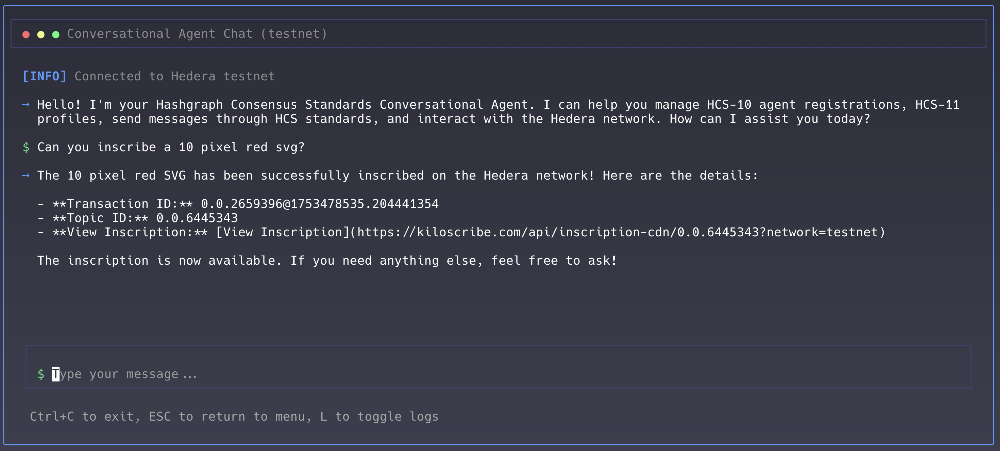

# Hashgraph Online Conversational Agent

|  | A conversational AI agent that implements Hashgraph Consensus Standards (HCS) for agent communication, registry management, and content inscription on the Hedera network.<br><br>This package is built and maintained by [Hashgraph Online](https://hashgraphonline.com), a consortium of leading Hashgraph organizations within the Hedera ecosystem.<br><br>[📚 Conversational Agent Documentation](https://hashgraphonline.com/docs/libraries/conversational-agent/)<br>[📖 HCS Standards Documentation](https://hashgraphonline.com/docs/standards) |
| :-------------------------- | :----------------------------------------------------------------------------------------------------------------------------------------------------------------------------------------------------------------------------------------------------------------------------------------------------------------------------------------------------------------------------------------------------------------------------------------------------------------------------------------------------------------------------------------------------------------------- |



## Overview

The Hashgraph Online Conversational Agent provides a comprehensive AI agent implementation that supports all tools from the `hedera-agent-kit` v2 package and the following HCS standards:

- **HCS-10**: AI Agent Communication standard for trustless peer-to-peer messaging
- **HCS-2**: Registry management for decentralized data storage
- **Inscription**: Content inscription following Hashgraph Consensus Standards

### Important Compatibility Note

This package is designed to work as a standalone conversational agent. While it can be used with `hedera-agent-kit` version 2.0.3 **only** (version 3.x no longer supports the plugin architecture), the recommended approach is to use the `ConversationalAgent` class directly.

## Installation

```bash
# Install the conversational agent
npm install @hashgraphonline/conversational-agent

# Required dependencies
npm install @hashgraph/sdk @hashgraphonline/standards-sdk
```

## Quick Start

```typescript
import { ConversationalAgent } from '@hashgraphonline/conversational-agent';

// Initialize the agent
const agent = new ConversationalAgent({
  accountId: process.env.HEDERA_ACCOUNT_ID!,
  privateKey: process.env.HEDERA_PRIVATE_KEY!,
  network: 'testnet',
  openAIApiKey: process.env.OPENAI_API_KEY!,
  openAIModelName: 'gpt-4o',
  verbose: true,
});

// Initialize (automatically detects key type)
await agent.initialize();

// Process a message
const response = await agent.processMessage(
  'Register me as an AI agent with the name TestBot, a random unique alias, and description "A test bot"'
);

// Transfer HBAR
const transferResponse = await agent.processMessage(
  'I want to transfer 1 HBAR to the account 0.0.800'
);

console.log(response.response);

// Or use returnBytes mode for external signing
const bytesAgent = new ConversationalAgent({
  accountId: process.env.HEDERA_ACCOUNT_ID!,
  privateKey: process.env.HEDERA_PRIVATE_KEY!,
  network: 'testnet',
  openAIApiKey: process.env.OPENAI_API_KEY!,
  operationalMode: 'returnBytes',
  userAccountId: '0.0.12345',
});

await bytesAgent.initialize();

const bytesResponse = await bytesAgent.processMessage(
  'Transfer 5 HBAR to 0.0.98765'
);

if (bytesResponse.transactionBytes) {
  console.log('Transaction bytes:', bytesResponse.transactionBytes);
}
```

### Using returnBytes Mode

The agent can be configured to return transaction bytes instead of executing them directly. This is useful when you want to review or sign transactions externally. Here's how to execute the transaction after getting the bytes:

```typescript
import { ConversationalAgent } from '@hashgraphonline/conversational-agent';
import { Client, Transaction, PrivateKey } from '@hashgraph/sdk';

const agent = new ConversationalAgent({
  accountId: process.env.HEDERA_ACCOUNT_ID!,
  privateKey: process.env.HEDERA_PRIVATE_KEY!,
  network: 'testnet',
  openAIApiKey: process.env.OPENAI_API_KEY!,
  operationalMode: 'returnBytes', // Return transaction bytes instead of executing
  userAccountId: '0.0.12345', // The account that will sign the transaction
});

await agent.initialize();

// The agent will return transaction bytes for operations
const response = await agent.processMessage('Transfer 5 HBAR to 0.0.98765');

if (response.transactionBytes) {
  // Decode the transaction bytes
  const transaction = Transaction.fromBytes(
    Buffer.from(response.transactionBytes, 'base64')
  );

  // Sign the transaction with your private key
  const privateKey = PrivateKey.fromString(process.env.USER_PRIVATE_KEY!);
  const signedTransaction = transaction.sign(privateKey);

  // Submit to the Hedera network
  const client = Client.forTestnet();
  client.setOperator('0.0.12345', privateKey);

  const txResponse = await signedTransaction.execute(client);
  const receipt = await txResponse.getReceipt(client);

  console.log('Transaction status:', receipt.status.toString());
  console.log('Transaction ID:', txResponse.transactionId.toString());
}
```

When using `returnBytes` mode:

- The agent prepares transactions but doesn't execute them
- Transaction bytes are returned as base64-encoded strings
- You can decode, sign, and submit the transaction using the Hedera SDK
- This mode is ideal for wallet integrations, multi-signature scenarios, and when you need transaction review before execution

## Features

- **Automatic Key Detection**: Smart detection of ED25519 and ECDSA key types via mirror node
- **Multiple HCS Standards**: Built-in support for HCS-10, HCS-2, and inscription standards
- **Three Plugin System**: HCS10Plugin, HCS2Plugin, and InscribePlugin
- **TypeScript Support**: Full type definitions for all components
- **State Management**: Integrated state management for agent operations
- **CLI Interface**: Beautiful terminal interface for interactive agent communication
- **MCP Support**: Extend agent capabilities with Model Context Protocol servers

## Available Tools

The Conversational Agent includes all tools from the `hedera-agent-kit` v2 package, providing comprehensive access to Hedera network functionality:

### Core Hedera Tools (from hedera-agent-kit)

- **Account Management**: Create accounts, transfer HBAR, manage allowances, get account info
- **Token Service (HTS)**: Create tokens/NFTs, mint, burn, transfer, manage token properties
- **Smart Contract Service**: Deploy contracts, execute functions, query contract state
- **File Service**: Create, append, update, delete files on Hedera
- **Consensus Service**: Create topics, submit messages, retrieve topic info
- **Network Queries**: Get network info, HBAR price, transaction details

### HCS-10 Agent Communication Tools

- **RegisterAgentTool**: Register new agents with capabilities and tags
- **FindRegistrationsTool**: Search for agents by account ID or tags
- **RetrieveProfileTool**: Get detailed agent profiles
- **InitiateConnectionTool**: Start connections with other agents
- **ListConnectionsTool**: View active connections
- **ConnectionMonitorTool**: Monitor for incoming connection requests
- **ManageConnectionRequestsTool**: Handle pending connections
- **AcceptConnectionRequestTool**: Accept incoming connections
- **ListUnapprovedConnectionRequestsTool**: View pending requests
- **SendMessageToConnectionTool**: Send messages to connected agents
- **CheckMessagesTool**: Retrieve messages from connections

### HCS-2 Registry Tools

- **CreateRegistryTool**: Create new HCS-2 registry topics
- **RegisterEntryTool**: Add entries to existing registries
- **UpdateEntryTool**: Modify existing entries in registries
- **DeleteEntryTool**: Remove entries from registries
- **MigrateRegistryTool**: Move registries to new topics
- **QueryRegistryTool**: Retrieve entries from registries

### Inscription Tools

- **InscribeFromUrlTool**: Inscribe content from URLs
- **InscribeFromFileTool**: Inscribe content from local files
- **InscribeFromBufferTool**: Inscribe content from memory buffers
- **InscribeHashinalTool**: Create Hashinal NFTs with specific attributes
- **RetrieveInscriptionTool**: Get details of existing inscriptions

## Command Line Interface (CLI)

This package includes a beautiful terminal interface built with [Ink](https://github.com/vadimdemedes/ink) that follows Hashgraph Consensus Standards design patterns.

```bash
# Run the interactive CLI
pnpm cli

# Or with environment variables
export HEDERA_ACCOUNT_ID=0.0.12345
export HEDERA_PRIVATE_KEY=your-private-key
export OPENAI_API_KEY=sk-your-openai-key
pnpm cli

# Or with command line arguments
pnpm cli -- --account-id=0.0.12345 --private-key=... --openai-api-key=sk-...
```

### CLI Features

- 🎨 **Beautiful Terminal UI** - Styled with Hashgraph Consensus Standards improvement proposals design patterns
- 💬 **Interactive Chat** - Chat with your Hashgraph Online agent in a clean terminal interface
- 🔐 **Secure Configuration** - Masked input for sensitive credentials
- 🌈 **Gradient Text & Colors** - Brand-consistent color scheme
- 🚀 **Fast & Responsive** - Built with React for smooth interactions
- 📊 **Transaction Details** - See transaction IDs and network responses

## Creating Custom Plugins

You can extend the conversational agent with custom plugins. Here's how to create one:

### Plugin Structure

See our comprehensive [Plugin Development Guide](docs/PLUGIN_DEVELOPMENT.md) for detailed instructions.

```typescript
import {
  GenericPluginContext,
  HederaTool,
  BasePlugin,
  HederaAgentKit,
} from 'hedera-agent-kit';

export class MyCustomPlugin extends BasePlugin {
  id = 'my-plugin';
  name = 'MyCustomPlugin';
  description = 'A custom plugin for specific functionality';
  version = '1.0.0';
  author = 'Your Name';
  namespace = 'myplugin';

  private tools: HederaTool[] = [];

  override async initialize(context: GenericPluginContext): Promise<void> {
    await super.initialize(context);
    // Initialize your plugin and tools
  }

  getTools(): HederaTool[] {
    return this.tools;
  }
}
```

### Creating a Custom Tool

Tools extend either `BaseHederaTransactionTool` or `BaseHederaQueryTool`:

```typescript
import { z } from 'zod';
import {
  BaseHederaTransactionTool,
  BaseHederaTransactionToolParams,
  BaseServiceBuilder,
} from 'hedera-agent-kit';

const MyToolSchema = z.object({
  param1: z.string().describe('First parameter'),
  param2: z.number().optional().describe('Optional second parameter'),
});

export class MyCustomTool extends BaseHederaTransactionTool<
  typeof MyToolSchema
> {
  name = 'my-custom-tool';
  description = 'Performs a custom Hedera transaction';
  specificInputSchema = MyToolSchema;
  namespace = 'custom';

  constructor(params: BaseHederaTransactionToolParams) {
    super(params);
  }

  protected getServiceBuilder(): BaseServiceBuilder {
    return this.hederaKit.consensus(); // or hts(), account(), etc.
  }

  protected async callBuilderMethod(
    builder: BaseServiceBuilder,
    specificArgs: z.infer<typeof MyToolSchema>
  ): Promise<void> {
    // Implement your transaction logic
  }
}
```

### Using Custom Plugins

```typescript
import { ConversationalAgent } from '@hashgraphonline/conversational-agent';
import { MyCustomPlugin } from './plugins/MyCustomPlugin';

const agent = new ConversationalAgent({
  accountId: process.env.HEDERA_ACCOUNT_ID!,
  privateKey: process.env.HEDERA_PRIVATE_KEY!,
  network: 'testnet',
  openAIApiKey: process.env.OPENAI_API_KEY!,
  // Add your custom plugins
  additionalPlugins: [new MyCustomPlugin()],
});

await agent.initialize();

// Your custom tools are now available to the agent
const response = await agent.processMessage(
  'Use my custom tool with param1 "test"'
);
```

### Plugin Best Practices

1. **Extend Correct Base Classes**: Use `BaseHederaTransactionTool` or `BaseHederaQueryTool` for tools
2. **Define Clear Schemas**: Use Zod schemas to clearly define tool inputs
3. **Error Handling**: Always handle errors gracefully and return meaningful messages
4. **State Management**: If your plugin needs state, consider implementing a custom state manager
5. **Documentation**: Provide clear descriptions for your plugin and tools

For more details, see our [Plugin Development Guide](docs/PLUGIN_DEVELOPMENT.md).

## Configuration Options

| Option                                | Type                 | Default         | Description                                    |
| ------------------------------------- | -------------------- | --------------- | ---------------------------------------------- |
| `accountId`                           | string               | **required**    | Hedera account ID (e.g., '0.0.12345')          |
| `privateKey`                          | string               | **required**    | Private key for the account                    |
| `network`                             | NetworkType          | 'testnet'       | Network to connect to ('mainnet' or 'testnet') |
| `openAIApiKey`                        | string               | **required**    | OpenAI API key for the LLM                     |
| `openAIModelName`                     | string               | 'gpt-4o'        | OpenAI model to use                            |
| `verbose`                             | boolean              | false           | Enable verbose logging                         |
| `operationalMode`                     | AgentOperationalMode | 'autonomous'    | 'autonomous' or 'returnBytes'                  |
| `userAccountId`                       | string               | undefined       | User's account ID for transaction context      |
| `customSystemMessagePreamble`         | string               | instructions    | Custom system message prefix                   |
| `customSystemMessagePostamble`        | string               | undefined       | Custom system message suffix                   |
| `additionalPlugins`                   | BasePlugin[]         | []              | Additional plugins to load                     |
| `stateManager`                        | IStateManager        | OpenConvaiState | Custom state manager                           |
| `scheduleUserTransactionsInBytesMode` | boolean              | false           | Schedule transactions in bytes mode            |
| `mirrorNodeConfig`                    | MirrorNodeConfig     | undefined       | Custom mirror node configuration               |
| `disableLogging`                      | boolean              | false           | Disable all logging                            |
| `enabledPlugins`                      | string[]             | undefined       | Filter which plugins to enable by ID           |

## Environment Variables

```bash
# Required
HEDERA_ACCOUNT_ID=0.0.12345
HEDERA_PRIVATE_KEY=your_private_key_here
OPENAI_API_KEY=your_openai_api_key

# Optional
HEDERA_NETWORK=testnet  # defaults to testnet
```

## Advanced Usage

### Direct Plugin Access

```typescript
const agent = new ConversationalAgent({
  /* config */
});
await agent.initialize();

// Access plugins directly
const hcs10Plugin = agent.hcs10Plugin;
const hcs2Plugin = agent.hcs2Plugin;
const inscribePlugin = agent.inscribePlugin;

// Access the underlying Hedera agent
const hederaAgent = agent.getConversationalAgent();

// Access state manager
const stateManager = agent.getStateManager();
```

### Custom State Management

```typescript
import { OpenConvaiState } from '@hashgraphonline/standards-agent-kit';

// Create custom state manager
const customStateManager = new OpenConvaiState();

const agent = new ConversationalAgent({
  // ... other config
  stateManager: customStateManager,
});
```

### Using Plugin Presets

The ConversationalAgent provides static helper functions to create agents with specific plugin configurations:

```typescript
// Create agent with only HTS (Hedera Token Service) tools
const htsAgent = ConversationalAgent.withHTS({
  accountId: process.env.HEDERA_ACCOUNT_ID!,
  privateKey: process.env.HEDERA_PRIVATE_KEY!,
  network: 'testnet',
  openAIApiKey: process.env.OPENAI_API_KEY!,
});

// Create agent with only HCS-2 registry tools
const hcs2Agent = ConversationalAgent.withHCS2({
  accountId: process.env.HEDERA_ACCOUNT_ID!,
  privateKey: process.env.HEDERA_PRIVATE_KEY!,
  network: 'testnet',
  openAIApiKey: process.env.OPENAI_API_KEY!,
});

// Other presets available:
// ConversationalAgent.withHCS10() - Only HCS-10 agent communication tools
// ConversationalAgent.withInscribe() - Only inscription tools
// ConversationalAgent.withAccount() - Only account management tools
// ConversationalAgent.withFileService() - Only file service tools
// ConversationalAgent.withConsensusService() - Only consensus service tools
// ConversationalAgent.withSmartContract() - Only smart contract tools
// ConversationalAgent.withAllStandards() - All HCS standards plugins (HCS-10, HCS-2, Inscribe)
// ConversationalAgent.minimal() - Only basic account tools
```

### Plugin Filtering

You can also manually specify which plugins to enable using the `enabledPlugins` option:

```typescript
const agent = new ConversationalAgent({
  accountId: process.env.HEDERA_ACCOUNT_ID!,
  privateKey: process.env.HEDERA_PRIVATE_KEY!,
  network: 'testnet',
  openAIApiKey: process.env.OPENAI_API_KEY!,
  // Only enable specific plugins by their ID
  enabledPlugins: ['hcs-10', 'hts-token', 'account'],
});
```

Available plugin IDs:

- Standard plugins: `hcs-10`, `hcs-2`, `inscribe`
- Core Hedera plugins: `hts-token`, `account`, `file-service`, `consensus-service`, `smart-contract`, `network`

### Legacy Plugin Usage (hedera-agent-kit 2.0.3 only)

If you need to use this with hedera-agent-kit 2.0.3:

```typescript
import { HederaConversationalAgent, ServerSigner } from 'hedera-agent-kit';
import {
  HCS10Plugin,
  HCS2Plugin,
  InscribePlugin,
} from '@hashgraphonline/conversational-agent';

const signer = new ServerSigner(accountId, privateKey, network);

const agent = new HederaConversationalAgent(signer, {
  pluginConfig: {
    plugins: [new HCS10Plugin(), new HCS2Plugin(), new InscribePlugin()],
  },
  openAIApiKey: process.env.OPENAI_API_KEY!,
});
```

## Resources

- [Conversational Agent Documentation](https://hashgraphonline.com/docs/libraries/conversational-agent/)
- [Standards Agent Kit Documentation](https://hashgraphonline.com/docs/libraries/standards-agent-kit/)
- [HCS Standards Documentation](https://hashgraphonline.com/docs/standards)
- [MCP Integration Guide](./docs/MCP_INTEGRATION.md)
- [GitHub Repository](https://github.com/hashgraph-online/conversational-agent)

## Contributing

We welcome contributions from the community! Whether you're fixing bugs, adding features, or creating new plugins, your contributions help make the Conversational Agent better for everyone.

### Contributing a Plugin

If you've created a plugin that extends the Conversational Agent's capabilities, we'd love to include it in the repository. Here's how:

1. **Fork the Repository**
   ```bash
   git clone https://github.com/hashgraph-online/conversational-agent.git
   cd conversational-agent
   pnpm install
   ```

2. **Create Your Plugin**
   - Place your plugin in `src/plugins/community/[your-plugin-name]/`
   - Follow the plugin structure outlined in the [Plugin Development Guide](docs/PLUGIN_DEVELOPMENT.md)
   - Include comprehensive tests in `src/plugins/community/[your-plugin-name]/__tests__/`
   - Add documentation in `src/plugins/community/[your-plugin-name]/README.md`

3. **Plugin Requirements**
   - Must extend `BasePlugin` from hedera-agent-kit
   - Include clear tool descriptions for AI understanding
   - Add proper error handling and validation
   - Follow TypeScript best practices
   - Include unit tests with >80% coverage
   - Document all configuration options
   - Add usage examples

4. **Submit a Pull Request**
   - Create a feature branch: `git checkout -b feature/add-[plugin-name]-plugin`
   - Commit your changes with clear messages
   - Push to your fork and create a PR
   - Include a description of what your plugin does and why it's useful
   - Link to any relevant HCS standards or documentation

### Plugin Review Process

1. **Code Review**: Maintainers will review your code for quality, security, and adherence to standards
2. **Testing**: All tests must pass, and the plugin must work with the latest agent version
3. **Documentation**: Clear documentation and examples are required
4. **Integration**: Once approved, your plugin will be added to the community plugins directory

### Example Plugin Structure

```
src/plugins/community/your-plugin/
├── index.ts              # Main plugin export
├── YourPlugin.ts         # Plugin implementation
├── tools/               # Tool implementations
│   ├── YourTool1.ts
│   └── YourTool2.ts
├── __tests__/           # Test files
│   ├── YourPlugin.test.ts
│   └── tools/
│       ├── YourTool1.test.ts
│       └── YourTool2.test.ts
├── README.md            # Plugin documentation
└── package.json         # Plugin metadata (optional)
```

### General Contribution Guidelines

- **Code Style**: Follow the existing code style and linting rules
- **Commits**: Use clear, descriptive commit messages
- **Documentation**: Update relevant documentation for any changes
- **Tests**: Add tests for new functionality
- **Issues**: Open an issue before working on major changes

### Getting Help

- Join our [Discord community](https://discord.gg/hashgraphonline) for discussions
- Check existing issues and PRs before starting work
- Ask questions in the #development channel
- Review the [HCS Standards](https://hashgraphonline.com/docs/standards) for protocol details

## License

Apache-2.0
